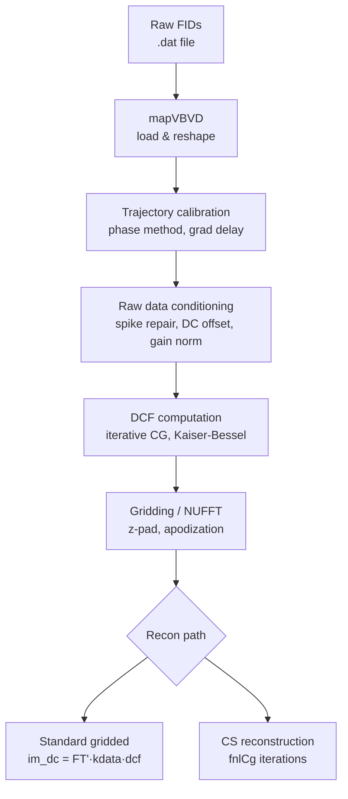

# ASAP Reconstruction

## Overview

ASAP = **As Spiral As Possible**. A 3D non-Cartesian k-space trajectory designed to spiral as aggressively as hardware gradient limits allow, producing better incoherence properties than simple 3D radial. Used for Xe129 hyperpolarized gas MRI and proton ACR phantom work.

- Learning/theory side: [[MRI-Learning]]
- CS adaptation work: [[CS-ASAP-Adaptation]]
- Full code pipeline: [[CS-ASAP-Pipeline]]
- Raw pipeline notes: `Action/MRI/ASAP Recon/`

---

## Trajectory Structure

Three nested levels — total k-space points = `NI × NPTS × NREPS`:

```
NREPS repetitions
  └── NI interleaves per rep          ← spoke directions on sphere
        └── NPTS readout points       ← samples along each spoke
```

### Confirmed Parameters — v2 ACR Phantom (2025-08-16)

| Parameter | Value | Notes |
|-----------|-------|-------|
| NI | 26 | interleaves per rep (`data.nLin`) |
| NPTS | 512 | samples per interleaf (`data.nCol`) |
| NREPS | 32 | repetitions (`data.nRep`) |
| Ntotal | 425,984 | = 512 × 26 × 32 (confirmed from ACR_data.mat) |
| FOV | 250 mm | `data.fovPE` (v2 scan) |
| matrix | 80 | from `special.MatSize` in header |
| dwell | 5 µs | `data.dwelltime` × 1e6 |
| readout | 2560 µs | nsamples × dwell |
| gamma | 42.577 MHz/T | proton |
| Ncoils | 1 | single-channel head coil for ACR |

### Typical Parameters (kasap.c defaults — may differ from actual scan)

| Parameter | Value | Notes |
|-----------|-------|-------|
| dt | 10 µs | dwell time |
| t0 | 40 µs | pre-readout dead time |
| kmax | ms/(2·FOV) | in cycles/m |
| MAXG | 40 mT/m | hardware limit |
| MAXS | 150 T/m/s | hardware slew limit |

---

## How kasap.c Generates the Trajectory

1. **Spoke directions:** `NI` unit vectors (`initv[]`) on sphere — Fibonacci (fast) or Thompson-optimized (iterative electrostatic repulsion, better uniformity).

2. **Radial law kr(t):** Monotonic ramp from 0 → kmax. Power-law shape, hardware limits enforced via derived angular velocity `w = min(wG, wS)`.

3. **Spiral twist:** Rotation axis `rotvec` precesses around x-hat each step; k-vectors rotate around it by `w·dt`. This is the "spiral as possible" character.

4. **Ramp-down:** Gradient tapered to zero at end of readout within slew constraint.

5. **Per-rep rotation:** All spokes rotated 90° around rep-specific axis (`reprot[irep]`), drawn from a second hedgehog of NREPS directions. Distributes coverage across reps.

**Output arrays** (per rep, indexed as `lin = ir + j*NPTS`):
- `kx/ky/kz` — k-space coordinates
- `gx/gy/gz` — gradient waveforms (T/m)

Text file format: header `NI NREPS NPTS`, then one `x y z` per line.

---

## Reconstruction Pipeline



### Key Steps

**Trajectory calibration**
- Two-slice (±D) phase method for k(t) measurement
- Gradient delay correction: estimate Δx, Δy, Δz via k-space center tracking
- Savitzky-Golay smoothing on phase derivative, then integrate → k(t)
- Enforce k(0)≈0: project out constant offsets after smoothing

**Raw data conditioning**
- Noise spike repair: moving-average z-score detection, replace by local mean
- Interleaf DC offset subtraction (all leaves start at same k0)
- Per-leaf gain normalization to common reference

**DCF**
- Warm-start from analytical spiral DCF
- 3–5 CG iterations (iterative DCF)
- Kernel: Kaiser-Bessel (k=5, os=2–3)

---

## Raw Data Format (confirmed)

**Access pattern** — after `load_rawdata_20250816`:
```matlab
raw_flat = squeeze(twixs.file1.image(:,:,:,:,:,:,:,:,:,:,:));
% → flat vector of length nsamples × nchannels × nblocks
rawdata = reshape(raw_flat, nsamples, nchannels, nblocks);
% shape: [512 × 1 × 832]   (1 coil, 832 total interleaf blocks)
```

Then aggregated into `raw_gp [nsamples × nleaves × nreps × ncoils]` = `[512 × 26 × 32 × 1]`, then flattened:
```matlab
rawdata2 = reshape(raw_gp, [], nchannels);   % [425984 × 1]
```

**Trajectory** — from `loadtrajectory3D('BuildFromXYZ', ...)`:
- Returns `KSpaceCoor` as `[Nseg × 3]` in **1/mm**
- `Nseg = nsamples × nleaves_per_rep` (one rep worth; tiled to match rawdata2 if needed)
- `cal.kmax_measured` stores the measured kmax in 1/mm

**Saved intermediate** — `ACR_data.mat`:
```
a  [425984 × 5]  float32
   col 1: Re(rawdata2)
   col 2: Im(rawdata2)
   col 3: KSpaceCoor(:,1)  kx in 1/mm
   col 4: KSpaceCoor(:,2)  ky in 1/mm
   col 5: KSpaceCoor(:,3)  kz in 1/mm
```

---

## What CS Needs from ASAP

Three arrays in `ACR_test.mat` (produced by Python notebook from `ACR_data.mat`):

| Variable | Shape (3D static, 1 frame) | Units | Notes |
| -------- | -------------------------- | ----- | ----- |
| `ktrajs` | `[1 × 3 × 425984]` | radians | normalized to [−π, π] by dividing by `dk_mag.max()` then ×π |
| `kdatas` | `[1 × 425984]` | a.u. | complex, coil-combined |
| `kcomps` | `[1 × 425984]` | a.u. | DCF from `torchkbnufft.calc_density_compensation_function` |

The MATLAB CS script (`spiral3d_cs_3D_hoom.m`) then divides `ktrajs` by `2π` → `[−0.5, 0.5]` for IRT NUFFT3D.

⚠️ The DCF in `ACR_test.mat` is recomputed in Python (pipe method), discarding the iterative KB DCF from the MATLAB pipeline. Both are valid; they haven't been compared yet.

See [[CS-ASAP-Pipeline]] for the full chain.

---

## Log

### 2026-05-22 — Wiki page created
- Source: kasap.c (2024_Steve_dynamiccode), ASAP Recon Pipeline.md, ASAP Trajectory.md
- Created in Cowork session while planning 2026_Xe129_CS adaptation

### 2026-05-22 — Confirmed from code + data
- Source: Cowork session — read `spiral_gpt_ACR_20250925.m`, `cs_spiral_gpt_ACR_hoom_20250924.m`, `spiral3d_frames_mat_hoom.ipynb`, `ACR_data.mat`, `ACR_test.mat`
- ✅ Confirmed: NI=26, NPTS=512, NREPS=32, FOV=250mm, matrix=80, 1 coil
- ✅ Confirmed: raw data access via `twixs.file1.image` squeeze+reshape
- ✅ Confirmed: trajectory from `loadtrajectory3D` in 1/mm; CS uses [-π,π] normalization via Python
- ✅ Confirmed: end-to-end CS pipeline already working on ACR data
- 🔲 Open: compare iterative KB DCF (MATLAB) vs pipe DCF (Python/torchkbnufft) quality
- 🔲 Open: same pipeline for Xe129 data (Phase 2)
